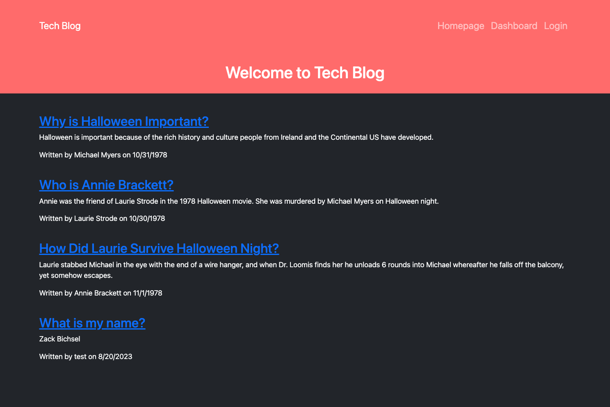

# tech-blog

\
\
\

  ## Description

A tech blog serves as a digital haven where technology enthusiasts, professionals, and curious minds converge to explore, understand, and discuss the dynamic world of innovation. Its purpose is to dissect complex technological concepts, trends, and advancements, presenting them in accessible and engaging ways. This web application focuses on using various technologies to create a fully functional technology blog where the user can create an account, login, create a new blog, update an existing blog, and delete blogs. The user is also able to interact with other people who have created blogs and make comments on their blogs.

  ## Table of Contents
  - [Installation](#installation)
  - [Usage](#usage)
  - [License](#license)
  - [Questions](#questions)

  ## Installation

Git clone the repository.

Please make sure that the **dependencies** have been installed. If not, please run the following commands:

`npm i express`\
`npm i express-handlebars`\
`npm i express-session`\
`npm i mysql2`\
`npm i sequelize`\
`npm i connect-session-sequelize`\
`npm i dotenv`\
`npm i bcrypt`

This will install the necessary packages and versions which are necessary for the application to run. Learn more about [Mysql2](https://www.npmjs.com/package/mysql2), [Sequelize](https://www.npmjs.com/package/sequelize), [Dotenv](https://www.npmjs.com/package/sequelize), [Express](https://www.npmjs.com/package/express), [Bcrypt](https://www.npmjs.com/package/bcrypt), [Express-Session](https://www.npmjs.com/package/express-session), [Connect-Session-Sequelize](https://www.npmjs.com/package/connect-session-sequelize), and [Handlebars](https://www.npmjs.com/package/handlebars) in the links provided.

  ## Usage

To access this note taker application, please run the following command in your integrated terminal for this repository:

`node server.js`

  ## Screenshot

  

  ## License

This project is licensed under MIT. Please check LICENSE document in repository for more information.

  ## How to Contribute

If you would like to contribute to this project, please open a new issue or submit a pull request.

  ## Tests

There are currently no test for this application

  ## Questions

  If you have any questions, feel free to reach me at [GitHub](https://github.com/zbichsel) or via email at [biksel09@gmail.com](biksel09@gmail.com).